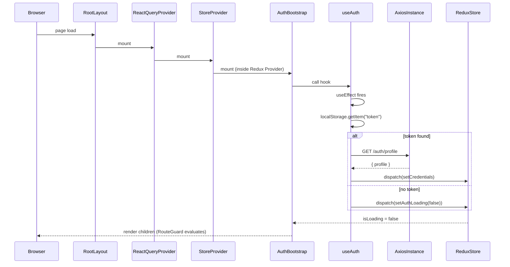
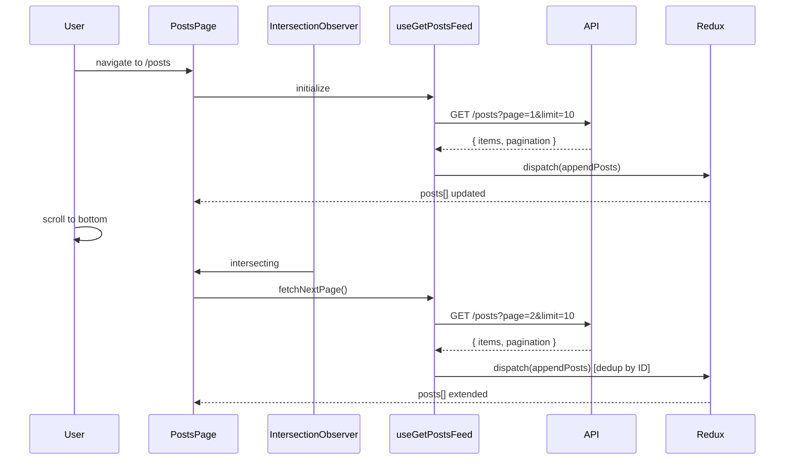
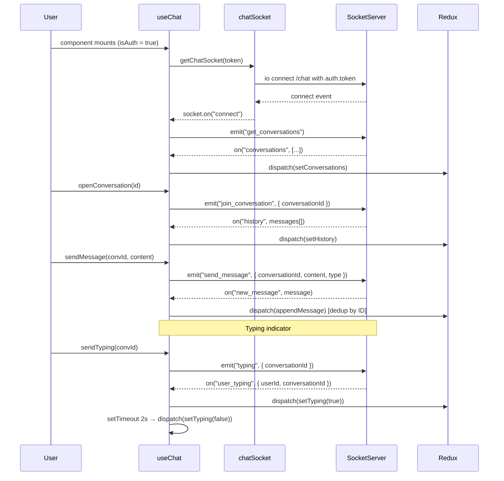
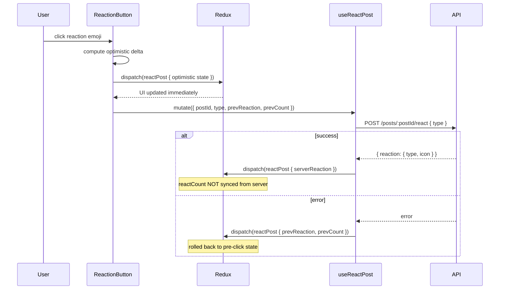
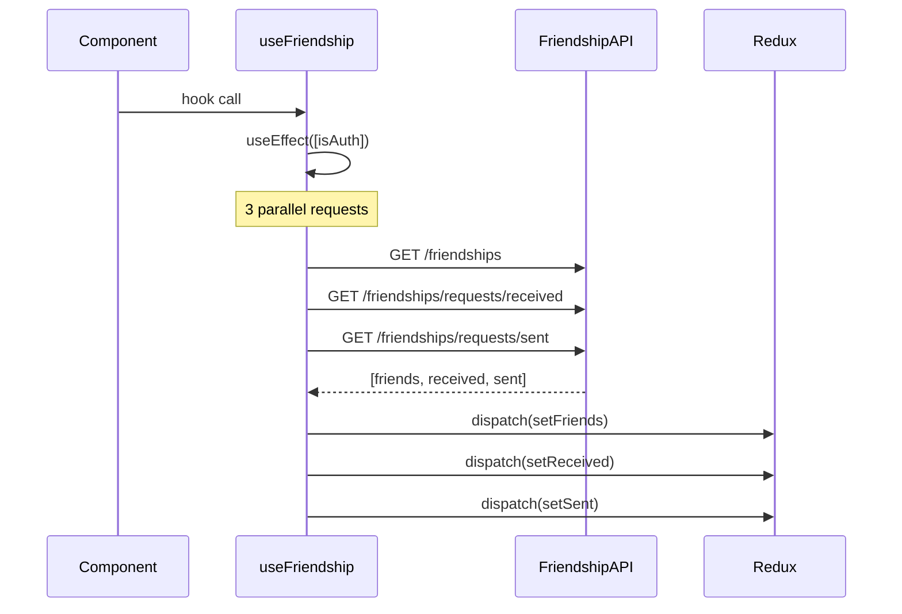
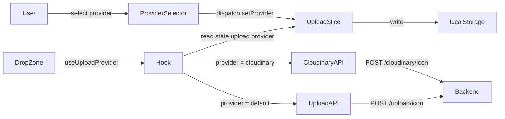
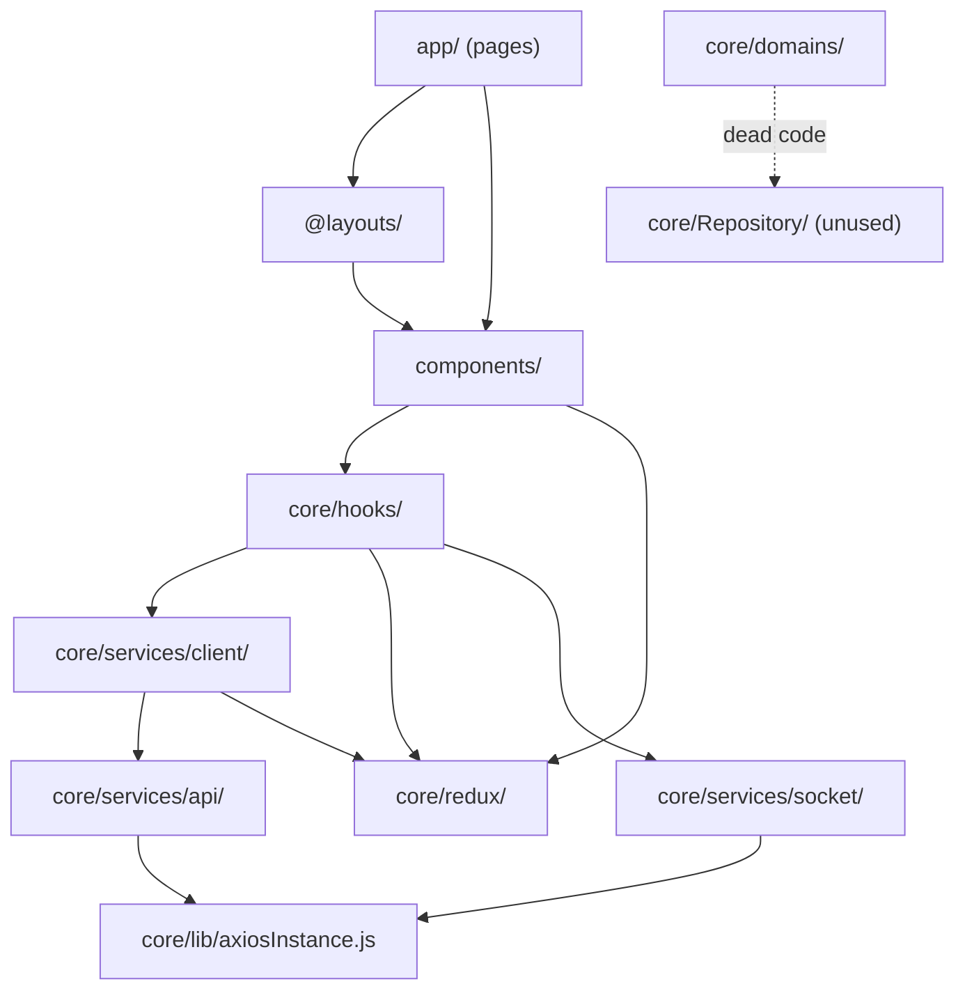

# Architecture Audit — Productivity Blog Frontend

> **Audited by:** Principal Engineer Review  
> **Date:** 2026-06-03  
> **Codebase:** `/src/` — Next.js 15 App Router, React 19, TypeScript  
> **Scope:** Full frontend. Backend not included.

---

## Table of Contents

1. [Architecture Overview](#1-architecture-overview)
2. [Directory Structure & Layer Responsibilities](#2-directory-structure--layer-responsibilities)
3. [Dependency Direction & Flow](#3-dependency-direction--flow)
4. [State Management Architecture](#4-state-management-architecture)
5. [Feature-by-Feature Breakdown](#5-feature-by-feature-breakdown)
   - 5.1 [Authentication & Session](#51-authentication--session)
   - 5.2 [Post Feed (Infinite Scroll)](#52-post-feed-infinite-scroll)
   - 5.3 [Post Reactions](#53-post-reactions)
   - 5.4 [Comments](#54-comments)
   - 5.5 [Real-time Chat (Socket.IO)](#55-real-time-chat-socketio)
   - 5.6 [Friendship System](#56-friendship-system)
   - 5.7 [File Upload (Dual-Provider)](#57-file-upload-dual-provider)
   - 5.8 [AI Chat (Gemini)](#58-ai-chat-gemini)
   - 5.9 [EPUB Generator](#59-epub-generator)
   - 5.10 [Route Access Control](#510-route-access-control)
6. [Use-Case Catalog](#6-use-case-catalog)
7. [Dependency Analysis](#7-dependency-analysis)
8. [Flow Diagrams](#8-flow-diagrams)
9. [Risk Analysis & Code Smells](#9-risk-analysis--code-smells)
10. [Architecture Quality Assessment](#10-architecture-quality-assessment)
11. [Refactor Recommendations](#11-refactor-recommendations)
12. [Final Architecture Score](#12-final-architecture-score)

---

## 1. Architecture Overview

### Detected Style: **Layered + Feature-Scoped Hybrid**

The codebase does **not** follow a single canonical pattern. It combines:

| Pattern | Where Applied |
|---------|--------------|
| **Layered Architecture** | `api/` → `client/` → `hooks/` → `components/` |
| **Feature-scoped modules** | `redux/post.ts`, `hooks/chat/`, `components/posts/` |
| **Clean Architecture fragment** | `core/domains/user.ts`, `core/Repository/user.ts`, `core/applications/authenticate.ts` — but **abandoned mid-implementation** |
| **Provider Pattern** | `useUploadProvider()` — strategy switching at runtime |
| **Singleton Pattern** | `getChatSocket()` — module-level socket instance |
| **Observer Pattern** | `IntersectionObserver` for infinite scroll in `posts/page.tsx:36-50` |

### Technology Stack

| Layer | Technology | Version |
|-------|-----------|---------|
| Framework | Next.js App Router | 15.1.0 |
| UI Runtime | React | 19.0.0 |
| Language | TypeScript | ^5 |
| Global State | Redux Toolkit | ^2.5.0 |
| Server State | TanStack React Query | ^5.90.2 |
| HTTP Client | Axios | ^1.7.9 |
| Real-time | Socket.IO Client | ^4.8.3 |
| UI Components | Radix UI primitives + shadcn/ui | various |
| Styling | Tailwind CSS | ^3.4.1 |
| AI | @google/genai (Gemini) | ^1.21.0 |
| TTS | @elevenlabs/elevenlabs-js | ^2.17.0 |
| EPUB | epubjs | ^0.3.93 |
| Animation | pixi-live2d-display + pixi.js | 0.4.0 / 6.5.10 |
| Markdown | react-markdown + easymde | ^10.1.0 / ^2.20.0 |

---

## 2. Directory Structure & Layer Responsibilities

```
src/
├── core/                        # Business & infrastructure logic
│   ├── domains/user.ts          # Domain entity: IUser interface + User class
│   ├── Repository/user.ts       # Repository interface: IUserRepository (unused stub)
│   ├── applications/            # Use-case layer (empty — 1-line file)
│   ├── config/routes.ts         # Route access rules (private/public/guest-only)
│   ├── endpoints.ts             # Stub: ENDPOINTS.AUTH.LOGIN only
│   ├── lib/
│   │   ├── axiosInstance.js     # Shared Axios instance + interceptors
│   │   └── utils.ts             # cn() (classnames helper)
│   ├── plugins/reactQuery.ts    # QueryClient config + re-exports of RQ hooks
│   ├── providers/
│   │   ├── redux-provider.tsx   # Redux <Provider> + AuthBootstrap
│   │   └── ReactQuery.tsx       # <QueryClientProvider> wrapper
│   ├── redux/                   # Redux slices (global client state)
│   │   ├── store.ts             # configureStore with all reducers
│   │   ├── user.ts              # Auth state: profile, token, isAuth, isLoading
│   │   ├── post.ts              # Feed state: posts[], hasMore, selectedPost
│   │   ├── comment.ts           # Comments keyed by postId
│   │   ├── chat.ts              # Socket chat: conversations, messages, typing
│   │   ├── friendship.ts        # Friend lists: friends/received/sent
│   │   ├── upload.ts            # File list + provider preference
│   │   ├── aiChat.ts            # AI message history
│   │   └── epub.ts              # EPUB chapter + format state
│   ├── services/
│   │   ├── endpoints.ts         # Endpoints enum + FetchQueryKeys enum (canonical)
│   │   ├── api/                 # Raw Axios calls (no React hooks)
│   │   │   ├── posts.ts         # apiGetPosts, apiCreatePost, apiReactPost …
│   │   │   ├── comments.ts      # apiGetComments, apiCreateComment …
│   │   │   ├── friendships.ts   # friendshipApi object
│   │   │   ├── upload.ts        # uploadApi object
│   │   │   ├── cloudinary.ts    # cloudinaryApi object (normalizes response)
│   │   │   ├── aiChat.ts        # sentPrompts, clearContext
│   │   │   ├── epub.ts          # getAllEpub (BUG: uses undefined `prompt`)
│   │   │   ├── profile.ts       # profile update calls
│   │   │   └── transcription.ts # video upload with progress
│   │   ├── client/              # React Query wrappers + Redux side-effects
│   │   │   ├── posts.ts         # useGetPostsFeed, useCreatePost, useReactPost …
│   │   │   ├── comments.ts      # useGetComments, useCreateComment …
│   │   │   ├── aiChat.ts        # useAskGemini, useAskGeminiWithAction
│   │   │   └── epub.ts          # useGetAllEpub
│   │   └── socket/
│   │       └── chatSocket.ts    # Singleton Socket.IO factory
│   ├── hooks/                   # Business-level custom hooks
│   │   ├── auth/
│   │   │   ├── useAuth.ts       # Session restore on mount
│   │   │   ├── use-sign-in-with-passwod-email.ts  # login/signup (typo in name)
│   │   │   └── use-sign-up-with-jwt.ts            # OAuth JWT exchange
│   │   ├── chat/useChat.ts      # Socket event registration + actions
│   │   ├── friendship/useFriendship.ts # Friendship CRUD + selectors
│   │   ├── aiChat/
│   │   │   ├── useAskAiWithSound.ts
│   │   │   └── useClearAiContext.ts
│   │   ├── epub/ (6 hooks)      # EPUB-specific logic
│   │   ├── live2d/useLive2DModel.ts
│   │   ├── useConstants.ts      # App-wide constants
│   │   ├── useUploadProvider.ts # Strategy selector for upload API
│   │   ├── useFileHelpers.ts    # File utility helpers
│   │   └── use-toast.ts         # Toast notification hook
│   └── types/friendship.ts      # Friendship/FriendInfo interfaces
│
├── app/                         # Next.js App Router pages
│   ├── layout.tsx               # Root layout: providers + Live2D scripts
│   ├── page.tsx                 # / → redirects to /posts (server-side)
│   ├── auth/page.tsx            # Auth screen (sign-in/sign-up toggle)
│   ├── auth/callback/page.tsx   # OAuth callback: reads ?jwt= param
│   ├── posts/page.tsx           # Feed with infinite scroll
│   ├── posts/[id]/page.tsx      # Post detail
│   ├── create-post/page.tsx     # Markdown editor + image upload
│   ├── profile/page.tsx         # User profile + edit dialog
│   ├── friends/page.tsx         # Friend request management
│   ├── upload/page.tsx          # File manager
│   ├── epub/page.tsx            # EPUB generator
│   ├── portfolio/page.tsx       # Public portfolio showcase
│   ├── projects/page.tsx        # Projects listing
│   ├── face-test/page.tsx       # Live2D character test
│   ├── buttons/page.tsx         # UI component showcase
│   └── api/                     # Next.js Route Handlers
│       ├── tts/route.ts         # ElevenLabs TTS proxy
│       ├── google-tts/route.ts  # Google TTS proxy
│       └── gemini-tts/route.ts  # Gemini TTS proxy
│
├── @layouts/defaultLayout/      # Shell: RouteGuard + Navbar + Chat
│
├── components/                  # Presentational components
│   ├── auth/                    # sign-in-card, sign-up-card, auth-screen
│   ├── posts/                   # PostCard, PostDetailDialog, ReactionButton, CommentSection
│   ├── chat/                    # Full chat UI (8 components)
│   ├── profile/                 # EditProfileDialog
│   ├── layouts/                 # Navbar, RouteGuard, TitleManager
│   ├── epub/                    # AskAIPopup, Chapter list/detail, GenerateModal
│   ├── upload/                  # DropZone, FileCard, FilePicker, ProviderSelector …
│   ├── face/                    # Live2D components
│   ├── portfolio/               # Portfolio section components
│   ├── home/                    # HomeOverview, Skills
│   └── ui/                      # shadcn/ui primitives + custom dialogs
│
├── constants/index.ts           # (empty / placeholder)
└── types/chapter.ts             # Chapter type alias
```

### Layer Responsibilities

| Layer | File Pattern | Responsibility | Should Know About |
|-------|-------------|---------------|-------------------|
| **Domain** | `core/domains/` | Entity shape, business methods | Nothing else |
| **Repository interface** | `core/Repository/` | Abstract data contract | Domain only |
| **API (infrastructure)** | `core/services/api/` | Raw HTTP calls via Axios | axiosInstance, DTOs |
| **Client (query layer)** | `core/services/client/` | React Query + Redux dispatch | api/ + redux/ |
| **Redux slices** | `core/redux/` | Client-side state shape | Nothing (framework-agnostic) |
| **Hooks** | `core/hooks/` | Business orchestration | redux/ + services/ |
| **Pages** | `app/` | Route entry points | hooks + components |
| **Components** | `components/` | Rendering + local UI state | hooks + redux (via useSelector) |

---

## 3. Dependency Direction & Flow

### Correct dependency flow (as implemented)

```
app/pages
    │
    ▼
components/
    │
    ├──► core/hooks/          (orchestrates)
    │         │
    │         ├──► core/services/client/   (React Query + Redux side-effects)
    │         │         │
    │         │         ├──► core/services/api/   (raw Axios)
    │         │         │         │
    │         │         │         └──► core/lib/axiosInstance.js
    │         │         │
    │         │         └──► core/redux/   (dispatch actions)
    │         │
    │         └──► core/redux/   (useSelector)
    │
    └──► core/redux/   (useSelector directly in components — acceptable)
```

### Architecture violations

#### Violation 1: Abandoned Clean Architecture skeleton
`core/domains/user.ts`, `core/Repository/user.ts`, and `core/applications/authenticate.ts` form an incomplete Clean Architecture setup. The `User` domain class and `IUserRepository` interface exist but are **never used anywhere in the actual runtime code**. The `authenticate.ts` file is empty (1 line). This dead code misleads maintainers into thinking the app follows Clean Architecture when it does not.

#### Violation 2: Duplicate endpoint registries
- `src/core/endpoints.ts` — stub with only `ENDPOINTS.AUTH.LOGIN`
- `src/core/services/endpoints.ts` — canonical source with `Endpoints` enum and `FetchQueryKeys` enum

Both live side by side. `use-sign-in-with-passwod-email.ts:4` imports from `@/core/endpoints` (the stub), while all API files import from `@/core/services/endpoints`. This split creates confusion about the canonical source of truth for URLs.

#### Violation 3: Infrastructure concern in slice reducer
`src/core/redux/upload.ts:6-8` calls `localStorage.getItem()` inside the module body (`loadProvider()`), which runs during module initialization:
```typescript
// upload.ts:6-8
function loadProvider(): CloudProvider {
  if (typeof window === "undefined") return "default";
  return (localStorage.getItem("cloudProvider") as CloudProvider) ?? "default";
}
```
However the `initialState` uses the hardcoded `"default"` value, not `loadProvider()`. The `initProvider` action must be dispatched explicitly to sync from localStorage. This is inconsistent — the function exists but the initializer ignores it.

#### Violation 4: Business logic scattered into component
`ReactionButton.tsx:63-78` computes the optimistic state delta (toggle-off, increment, decrement) directly in the component rather than in a reducer action. The `reactPost` reducer at `redux/post.ts:73-85` accepts the final state but the derivation logic (was it a toggle-off? was there a previous reaction?) lives in the component.

#### Violation 5: Direct Axios call in auth hook
`use-sign-in-with-passwod-email.ts:35,45` and `use-sign-up-with-jwt.ts:34,41` both call `axiosInstance` directly and also mutate `axiosInstance.defaults.headers.common["Authorization"]` at runtime. This bypasses the interceptor system and couples business logic to the HTTP client instance.

#### Violation 6: `console.log` in production reducer
`core/redux/epub.ts:85`: `console.log("AI response:", action.payload)` is in `editAIResponse` reducer — this fires every time AI format data is set and will appear in production.

#### Violation 7: Bug in epub API
`core/services/api/epub.ts:5`: `console.log("getAllEpub -> prompt", prompt)` references the global `window.prompt` function, not a local variable. This is a latent bug — the function is otherwise unused, but the reference will log the native `prompt()` function reference on every call.

---

## 4. State Management Architecture

### Redux Store Configuration (`core/redux/store.ts`)

```typescript
const store = configureStore({
  reducer: {
    counter: counterSlice.reducer,  // ← dead code: Counter example never removed
    user: userReducer,
    chapters: chapterReducer,       // ← note: named "chapters" but file is epub.ts
    aiChat: aiChatReducer,
    post: postReducer,
    comment: commentReducer,
    chat: chatReducer,
    friendship: friendshipReducer,
    upload: uploadReducer,
  },
});
```

### Slice Analysis

#### `user` slice (`redux/user.ts`)
**Shape:**
```typescript
interface UserState {
  profile: UserProfile;   // fullName, username, profilePic, email, role, id
  token: string | null;   // JWT stored redundantly (also in localStorage)
  isAuth: boolean;
  isLoading: boolean;     // true on app start, false after session restore
}
```
**Quality:** Clean. `setCredentials` is the single write path for authenticated state. `logout` uses a full state replacement (not `Object.assign`) — correct. `updateProfile` uses spread — correct. `resetToDefault` is identical to `logout` — **dead code** (exists only for backward compatibility per comment).

#### `post` slice (`redux/post.ts`)
**Shape:**
```typescript
interface PostState {
  posts: Post[];
  hasMore: boolean;
  selectedPost: Post | null;
}
```
**Quality:** Excellent. `appendPosts` deduplicates by ID using a `Set`. `reactPost` applies the update to both `posts[]` and `selectedPost` atomically — correct. The `resetPosts` action correctly resets both `posts` and `hasMore`.

**Concern:** The `selectedPost` field serves two purposes: (1) post detail dialog data from the feed, (2) single post fetched by ID route. These are conflated in one field.

#### `comment` slice (`redux/comment.ts`)
**Shape:** `byPostId: Record<string, Comment[]>` — keyed by postId.  
**Quality:** Excellent. Deduplication in `appendComments`. `clearComments` uses `delete` on the record key — correct.

#### `chat` slice (`redux/chat.ts`)
**Shape:** `conversations[]`, `messages: Record<conversationId, Message[]>`, `typing: Record<conversationId, boolean>`, `isOpen`, `activeConversationId`.  
**Quality:** Good. `appendMessage` deduplicates by ID and bubbles the conversation to top. `toggleOpen` resets `activeConversationId` on close — correct.  
**Missing:** No unread count per conversation. No connection status flag. `readBy` field exists on `Message` type but is never written to.

#### `friendship` slice (`redux/friendship.ts`)
**Quality:** Mostly good. `upsertFriendship` has a known limitation documented inline:
```typescript
// friendship.ts:50-54
else if (f.status === "pending") {
  // Phân loại lại dựa trên danh sách hiện tại không đủ thông tin,
  // caller phải dispatch setReceived/setSent sau accept/reject nếu cần.
  state.sent.push(f);  // ← always puts pending into sent, even if it was received
}
```
This is a known design gap — `upsertFriendship` cannot distinguish sent vs received pending without additional context. Callers compensate by also dispatching `setSent` explicitly after calling `upsertFriendship`.

#### `upload` slice (`redux/upload.ts`)
**Quality:** Clean. `setProvider` writes to localStorage as a side effect inside the reducer — this is technically a side effect in a reducer (anti-pattern), but it's safe here because Redux Toolkit uses Immer and the side effect is idempotent.

#### `aiChat` slice (`redux/aiChat.ts`)
**Quality:** Minimal. No pagination, no conversation history beyond in-memory array. `conversationId` is optional and never set in practice. The slice is essentially a simple message queue.

#### `epub` slice (`redux/epub.ts` — registered as `chapters`)
**Quality:** Functional but has `console.log` debug code in the reducer (line 85). Chapter IDs use `Date.now()` which can collide if two chapters are added within the same millisecond.

### Dual State Management: Redux + React Query

The application mixes two state management systems with a clear intent:

| System | Manages | Sync Mechanism |
|--------|---------|---------------|
| Redux | Client UI state, local mutations, optimistic updates | Always source of truth for rendering |
| React Query | Server fetch lifecycle (loading/error/refetch) | `onSuccess` dispatches to Redux |

This hybrid works but creates **double truth**: after a successful fetch, the data lives in both React Query cache and Redux store. Components read from Redux (via `useSelector`), not from React Query's return value. This means:
- React Query retries, refetches, and cache invalidation all work correctly
- But the React Query cache is essentially write-only from the component's perspective
- Cache invalidation (`queryClient.invalidateQueries`) triggers a re-fetch that dispatches to Redux again — the correct round-trip

The pattern is internally consistent but non-standard and could confuse contributors unfamiliar with the pattern.

---

## 5. Feature-by-Feature Breakdown

### 5.1 Authentication & Session

#### Entry Point
`src/core/providers/redux-provider.tsx:13-16` — `AuthBootstrap` calls `useAuth()` inside the Redux Provider, which runs `restoreSession()` on every app mount.

#### Session Restore Flow
```
app/layout.tsx (render)
  └─► StoreProvider (redux-provider.tsx)
        └─► AuthBootstrap
              └─► useAuth() (hooks/auth/useAuth.ts)
                    └─► useEffect (runs once on mount)
                          ├─► localStorage.getItem("token")
                          │     ├─ null → dispatch(setAuthLoading(false))
                          │     └─ token found →
                          │           axiosInstance.GET /auth/profile
                          │             ├─ success → dispatch(setCredentials({ profile, token }))
                          │             └─ error → dispatch(logout()) + localStorage.removeItem("token")
```

#### Login Flow (password)
```
SignInCard component
  └─► useLoginWithPasswordEmail() (hooks/auth/use-sign-in-with-passwod-email.ts)
        └─► login(username, password)
              ├─► axiosInstance.POST /auth/login { identifier, password }
              │     └─ response: { access_token }
              ├─► localStorage.setItem("token", token)
              ├─► axiosInstance.defaults.headers.common["Authorization"] = Bearer token
              ├─► axiosInstance.GET /auth/profile
              └─► dispatch(setCredentials({ profile, token }))
```

**Validation flow:** Client-side form validation in `sign-in-card.tsx` — basic empty-field checks. No schema validation (Zod/Yup). No server-side error mapping into field-level errors.

**Business rules:**
- identifier can be username or email (backend resolves)
- Token is stored in `localStorage` — persistent across tabs and browser restarts
- After login, token is also injected into Axios defaults header redundantly (the request interceptor reads from `localStorage` on every request — the `defaults.headers` mutation is unnecessary)

**Error handling:** `catch (error)` sets `status: "error"` and calls `options.onError`. No specific HTTP status code handling. A 401 from `/auth/login` and a 500 are treated identically from the UI's perspective.

**Failure cases:**
- Network failure: caught, `isError = true`, user must retry manually
- 401 wrong credentials: caught, same as network failure (no user-friendly error message differentiation)
- Token expired between sessions: `useAuth.restoreSession` catches the 401 from `/auth/profile`, calls `logout()` cleanly

#### OAuth Flow (Google/Facebook)
```
OAuth provider → backend → redirect to /auth/callback?jwt=<token>
  └─► auth/callback/page.tsx
        └─► useSignUpWithJwt() (hooks/auth/use-sign-up-with-jwt.ts)
              └─► signUpWithJwt(token)
                    ├─► axiosInstance.POST /auth/auth-with-jwt { token }
                    ├─► localStorage.setItem("token", accessToken)
                    ├─► axiosInstance.GET /auth/profile
                    └─► dispatch(setCredentials({ profile, token: accessToken }))
```

#### Logout Flow
```
Navbar → signOut() (from useAuth)
  ├─► dispatch(logout())        — clears Redux store
  ├─► localStorage.removeItem("token")
  └─► router.push("/auth")
```

**Missing:** No server-side session invalidation call on logout. The JWT remains valid on the server until it naturally expires.

---

### 5.2 Post Feed (Infinite Scroll)

#### Entry Point
`src/app/posts/page.tsx`

#### Full Flow
```
posts/page.tsx
  ├─► useSelector(state.post) → { posts, hasMore }
  ├─► useGetPostsFeed() (services/client/posts.ts:35)
  │     └─► useInfiniteQuery({
  │           queryKey: [FetchQueryKeys.POST_GET_ALL],
  │           queryFn: async ({ pageParam }) =>
  │             ├─► apiGetPosts(pageParam, 10) (services/api/posts.ts:17)
  │             │     └─► axiosInstance.GET /posts?page=N&limit=10
  │             ├─► normalize response: data.items ?? data.data ?? data ?? []
  │             ├─► dispatch(appendPosts({ posts, hasMore }))
  │             └─► return { posts, hasMore, page }
  │         })
  │
  └─► IntersectionObserver on loaderRef div
        └─► on intersect: if (hasMore && !isFetchingNextPage) → fetchNextPage()
```

#### Client-side sort
Posts are sorted in the component on every render:
```typescript
// posts/page.tsx:20-23
const sortedPosts = [...posts].sort((a, b) => {
  const diff = new Date(a.createdAt).getTime() - new Date(b.createdAt).getTime();
  return sort === "newest" ? -diff : diff;
});
```
This is a pure client-side sort across all loaded posts. When `sort = "oldest"`, the infinite-scroll still fetches newest-first from the server (no query param sent for sort order). The visual result will be wrong for paginated data: page 1 posts sorted ascending, but page 2 posts not yet loaded. **This is a UX bug for the `oldest` sort mode.**

#### Post deletion optimistic update
```
PostCard onDelete → deletePost(id)
  └─► useDeletePost().mutate(id)
        ├─► mutationFn: apiDeletePost(id)
        │     └─► axiosInstance.DELETE /posts/:id
        └─► onSuccess: dispatch(removePost(id))
              + queryClient.invalidateQueries([POST_GET_ALL])
```
No optimistic deletion before server confirms — the post remains visible until the DELETE request completes.

---

### 5.3 Post Reactions

#### Entry Point
`src/components/posts/ReactionButton.tsx`

#### Full Optimistic Update Flow
```
User clicks reaction emoji
  └─► handleReact(type: ReactionType)
        ├─► compute optimistic delta:
        │     isToggleOff = prevReaction.type === type
        │     if isToggleOff → dispatch(reactPost({ reaction: null, reactCount: prevCount - 1 }))
        │     else if no prev reaction → dispatch(reactPost({ reaction: {type}, reactCount: prevCount + 1 }))
        │     else (change reaction) → dispatch(reactPost({ reaction: {type}, reactCount: prevCount }))
        │
        └─► react({ postId, type, prevReaction, prevCount })
              └─► useReactPost().mutate(...)
                    ├─► mutationFn: apiReactPost(postId, type)
                    │     └─► axiosInstance.POST /posts/:postId/react { type }
                    ├─► onSuccess(data): dispatch(reactPost({ postId, reaction: serverReaction }))
                    │     └─► sync to server truth (reactCount NOT synced in onSuccess — only reaction type)
                    └─► onError: dispatch(reactPost({ postId, reaction: prevReaction, reactCount: prevCount }))
                          └─► rollback to previous state
```

**Bug:** `onSuccess` at `services/client/posts.ts:144-148` dispatches `reactPost` without `reactCount`:
```typescript
dispatch(reactPost({ postId, reaction: serverReaction }));
```
But `reactPost` reducer checks `if (reactCount !== undefined) post.reactCount = reactCount`. So after server confirms, the count stays at the optimistically computed value — never synced to server truth. If the server returns a different count (e.g., another user reacted concurrently), the client count will be wrong until the next refetch.

---

### 5.4 Comments

#### Entry Point
`PostDetailDialog` → `CommentSection` component

#### Load Flow
```
useGetComments(postId) (services/client/comments.ts:19)
  └─► useInfiniteQuery({
        queryKey: [COMMENT_GET_BY_POST, postId],
        queryFn: ({ pageParam }) =>
          ├─► apiGetComments(postId, page, 20)
          │     └─► axiosInstance.GET /posts/:postId/comments?page=N&limit=20
          └─► dispatch(appendComments({ postId, comments, hasMore }))
      })
```

#### Create Comment Flow
```
CommentSection input submit
  └─► useCreateComment(postId).mutate({ content, iconUrl? })
        ├─► apiCreateComment(postId, body)
        │     └─► axiosInstance.POST /posts/:postId/comments
        └─► onSuccess(data):
              ├─► dispatch(addComment(data))   — prepend to local list
              └─► queryClient.invalidateQueries([COMMENT_GET_BY_POST, postId])
```

No optimistic comment creation — the comment appears only after server confirmation. For low-latency perception, this could be improved with an optimistic placeholder.

---

### 5.5 Real-time Chat (Socket.IO)

#### Architecture
```
chatSocket.ts — module-level singleton
  let socket: Socket | null = null

  getChatSocket(token) →
    if socket.connected → return existing
    if socket (stale) → disconnect + null
    create new io(CHAT_URL/chat, { auth: { token } })
```

#### Connection Lifecycle
```
useChat() — hooks/chat/useChat.ts
  └─► useEffect([isAuth, token])
        ├─► if !isAuth || !token → return (no-op)
        ├─► getChatSocket(token)
        ├─► register event listeners:
        │     connect → emit get_conversations
        │     conversations → dispatch(setConversations)
        │     conversation_created → dispatch(upsertConversation) + emit join_conversation
        │     history → dispatch(setHistory)
        │     new_message → dispatch(appendMessage)  [deduplicates by id]
        │     user_typing → dispatch(setTyping(true)) + debounce 2s → dispatch(setTyping(false))
        │     error → console.error
        └─► cleanup:
              socket.off(all events)
              disconnectChatSocket()
```

#### Send Message Flow
```
ChatInput → sendMessage(conversationId, content)
  └─► getChatSocket(token!).emit("send_message", { conversationId, content, type: "text" })
        └─► server broadcasts "new_message" → dispatch(appendMessage(data))
```

#### Socket Events Summary

| Event (emit) | Trigger | Payload |
|-------------|---------|---------|
| `get_conversations` | on connect | — |
| `join_conversation` | open conversation or new conversation created | `{ conversationId }` |
| `create_conversation` | start chat with user | `{ targetUserId }` |
| `send_message` | user sends a message | `{ conversationId, content, type }` |
| `typing` | user typing | `{ conversationId }` |

| Event (on) | Trigger | Action |
|-----------|---------|--------|
| `connect` | socket connected | fetch conversations |
| `conversations` | server responds to get_conversations | `setConversations` |
| `conversation_created` | new DM created | `upsertConversation` + `setActiveConversation` + join |
| `history` | server sends message history | `setHistory` |
| `new_message` | any message in joined conversation | `appendMessage` (dedup) |
| `user_typing` | other user typing | `setTyping(true)` + 2s debounce clear |
| `error` | server error | `console.error` (no user-visible feedback) |

**Race condition risk:** If the user's auth token expires while the socket is connected, the socket will continue operating until the server closes it. The reconnection will fail because the token injected at connection time is now invalid. There is no mechanism to re-authenticate the socket after a token refresh.

**Missing:** No message acknowledgment (no `callback` on `send_message` emit). If the server drops the message, the client shows it (from the server's `new_message` broadcast) but has no way to detect send failure for its own messages without the server echoing back or the socket using ACKs.

---

### 5.6 Friendship System

#### Load on Mount
```
useFriendship() — hooks/friendship/useFriendship.ts:28-44
  └─► useEffect([isAuth])
        └─► if !isAuth → return
        └─► dispatch(setLoading(true))
        └─► Promise.all([
              friendshipApi.getFriends()         → GET /friendships
              friendshipApi.getReceivedRequests() → GET /friendships/requests/received
              friendshipApi.getSentRequests()     → GET /friendships/requests/sent
            ])
              → dispatch(setFriends, setReceived, setSent)
              → finally: dispatch(setLoading(false))
```

**Note:** 3 parallel requests on every component mount that uses `useFriendship()`. If `Navbar` and `FriendsPage` both mount and both use `useFriendship()`, this fires 6 requests simultaneously. There is no cache or deduplication for this pattern.

#### Send Friend Request
```
sendRequest(friendId)
  ├─► friendshipApi.sendRequest(friendId) → POST /friendships/request { friendId }
  ├─► dispatch(upsertFriendship(friendship))
  └─► dispatch(setSent([...sent, friendship]))
```
`upsertFriendship` + `setSent` is redundant — both add to the sent list. The `upsertFriendship` action has a bug for pending status (always adds to `sent`), and then `setSent` is called again to compensate. This leads to a potential **duplicate entry** in the `sent` list.

#### Accept Request
```
acceptRequest(id)
  ├─► friendshipApi.acceptRequest(id) → PATCH /friendships/:id/accept
  └─► dispatch(acceptLocal(friendship))
        ├─► remove from received list
        └─► push to friends list
```
Clean. No redundancy.

---

### 5.7 File Upload (Dual-Provider)

#### Provider Strategy
```
useUploadProvider() (hooks/useUploadProvider.ts)
  └─► useSelector(state.upload.provider)  → "default" | "cloudinary"
        └─► return provider === "cloudinary" ? cloudinaryApi : uploadApi
```

Both `cloudinaryApi` and `uploadApi` expose the same interface:
```typescript
interface FileAPI {
  uploadFile(file: File): Promise<string>   // returns publicUrl
  uploadIcon(file: File): Promise<string>
  listFiles(page, limit): Promise<PaginatedFiles>
  listIcons(page, limit): Promise<PaginatedFiles>
  deleteFile(id: string): Promise<void>
  deleteIcon(id: string): Promise<void>
}
```

`cloudinaryApi` adds a `normalize()` function to map Cloudinary's response shape (`{ publicId, url, format, size }`) into the standard `FileItem` shape.

**Bug in cloudinaryApi:** `deleteIcon` at `cloudinary.ts:62` calls `DELETE /cloudinary/files/${publicId}` (the files endpoint) instead of `/cloudinary/icons/${publicId}`. Icons and files share the same delete endpoint by mistake.

#### Upload Flow
```
DropZone → onFileDrop(file)
  └─► api.uploadIcon(file)  [or uploadFile]
        └─► POST /upload/icon  (or /cloudinary/icon)
              multipart/form-data: { file }
              └─► response: { publicUrl }
                    └─► dispatch(prependIcon(newFileItem))
```

No progress tracking for icon/file uploads (only `transcription.ts` has progress tracking via `onUploadProgress`).

---

### 5.8 AI Chat (Gemini)

#### Flow
```
AskAIPopup or face/chat/ChatFrame
  └─► useAskGemini().mutate(prompt)
        └─► sentPrompts(prompt) (services/api/aiChat.ts:3)
              └─► axiosInstance.POST /gemini/prompt-with-personal { prompt }
                    └─► response: { data: ... }
                          └─► onSuccess(data) → return data   [NOT dispatched to Redux]
```

**Critical gap:** `useAskGemini` at `services/client/aiChat.ts:8-18` has an `onSuccess` that simply returns `data` — it does **not** dispatch to the `aiChat` Redux slice. The AI message history in Redux is managed separately by whichever component calls `dispatch(addMessage(...))` directly, but the service hook does not do this automatically.

This means the chat history is not centrally managed — each component consuming `useAskGemini` must manually manage Redux state, creating a maintenance burden and potential inconsistency.

**Error handling:** `onError: (error) => console.log(error)` — no user-visible error feedback.

---

### 5.9 EPUB Generator

#### Bug: Undefined `prompt` reference
`core/services/api/epub.ts:5`:
```typescript
export const getAllEpub = async () => {
  console.log("getAllEpub -> prompt", prompt);  // ← uses window.prompt
  ...
```
`prompt` is the global browser `window.prompt()` function, not a variable. This will log the function reference and is a debug artifact left in production code.

#### EPUB state uses `Date.now()` as ID
`redux/epub.ts:51-54`:
```typescript
addChapter: (state, action: PayloadAction<Chapter["info"]>) => {
  state.items.push({
    id: Date.now(),   // collision risk if called twice in same ms
    ...
  });
},
```

---

### 5.10 Route Access Control

#### Architecture
```
DefaultLayout
  └─► RouteGuard (components/layouts/RouteGuard.tsx)
        └─► useSelector({ isAuth, isLoading })
        └─► useEffect([isAuth, isLoading, pathname]):
              if isLoading → return (wait)
              redirect = resolveRedirect(pathname, isAuth)
              if redirect → router.replace(redirect)
        └─► render guard:
              if isLoading → <LoadingScreen>
              if redirect needed → null (no flash)
              else → children
```

#### Route Config
```typescript
// core/config/routes.ts
const routes: RouteConfig[] = [
  { path: "/auth", access: "guest-only", exact: true },
  { path: "/auth/callback", access: "public", exact: true },
  { path: "/portfolio", access: "public" },
  { path: "/projects", access: "public" },
  { path: "/buttons", access: "public" },
  { path: "/", access: "private", exact: true },
  { path: "/create-post", access: "private" },
  { path: "/posts", access: "private" },
  { path: "/epub", access: "private" },
  { path: "/face-test", access: "private" },
  { path: "/profile", access: "private" },
];
const DEFAULT_ACCESS: RouteAccess = "private";
```

Any path not in the config defaults to `private`. This is a secure default — new routes require explicit opt-in to `public` access.

**Missing from config:** `/friends`, `/upload` — not listed but should be `private`. They are protected by the `DEFAULT_ACCESS = "private"` fallback, which works but is implicit.

---

## 6. Use-Case Catalog

### UC-01: Restore Session

| Field | Detail |
|-------|--------|
| **Purpose** | Restore auth state from localStorage token on app load |
| **Input** | `localStorage.getItem("token")` |
| **Output** | Redux `user` slice populated; or user redirected to `/auth` |
| **Business rules** | Token must be verifiable via `/auth/profile`; missing/invalid token → logout |
| **Dependencies** | `axiosInstance`, `useAuth`, `userSlice` |
| **Side effects** | Sets `isLoading = false` regardless of outcome |
| **Failure cases** | Network failure → logout (cannot distinguish from invalid token) |
| **Sequence** | App mount → `AuthBootstrap` → `useAuth` → effect → localStorage read → GET /auth/profile → dispatch |

### UC-02: Email/Password Login

| Field | Detail |
|-------|--------|
| **Purpose** | Authenticate user with identifier + password |
| **Input** | `username/email`, `password` |
| **Output** | Token in localStorage, Redux `user` populated, navigates to `/posts` |
| **Business rules** | `identifier` can be email or username; server resolves |
| **Dependencies** | `axiosInstance`, `useLoginWithPasswordEmail`, `userSlice` |
| **Side effects** | Sets `Authorization` header on `axiosInstance.defaults` (redundant with interceptor) |
| **Transaction boundary** | Two sequential requests: POST /auth/login + GET /auth/profile |
| **Failure cases** | Wrong credentials (401), server error (500), network failure — all treated the same |

### UC-03: Create Post

| Field | Detail |
|-------|--------|
| **Purpose** | Author creates a new markdown post with optional images |
| **Input** | `content: string`, `imageUrls: string[]` |
| **Output** | Post prepended to Redux `posts[]`, query cache invalidated + reset |
| **Business rules** | User must be authenticated; images must be pre-uploaded via file upload flow |
| **Dependencies** | `useCreatePost`, `postSlice.addPost`, `queryClient.invalidateQueries` |
| **Side effects** | `resetPosts()` called after creation — clears all loaded posts and re-fetches from page 1 |
| **Failure cases** | API error: no rollback (post never added optimistically) |

### UC-04: React to Post

| Field | Detail |
|-------|--------|
| **Purpose** | Toggle/change a reaction emoji on a post |
| **Input** | `postId`, `type: ReactionType` |
| **Output** | Optimistic update in Redux; server-synced after response |
| **Business rules** | Same reaction type = toggle off; different type = change reaction; reactCount adjusted locally |
| **Side effects** | Optimistic dispatch before API call; rollback on error |
| **Failure cases** | On error → reverts to `prevReaction` and `prevCount` |
| **Bug** | On success, server's `reactCount` is not synced back (only reaction type is synced) |

### UC-05: Send Chat Message

| Field | Detail |
|-------|--------|
| **Purpose** | Send a text message to a conversation via Socket.IO |
| **Input** | `conversationId: string`, `content: string` |
| **Output** | Server broadcasts `new_message` event; `appendMessage` dispatched |
| **Business rules** | Socket must be connected; user must be in the conversation |
| **Side effects** | Message deduplication by ID in Redux; conversation bubbled to top of list |
| **Failure cases** | No acknowledgment → no failure detection. Message dropped silently |
| **Concurrency** | Debounced typing indicator (2s clear) |

### UC-06: Send Friend Request

| Field | Detail |
|-------|--------|
| **Purpose** | Send a friendship request to another user |
| **Input** | `friendId: string` |
| **Output** | Friendship added to `sent` list |
| **Side effects** | Duplicate dispatch: `upsertFriendship` + `setSent` both add to sent list |
| **Bug** | Potential duplicate entry in `sent` list due to double dispatch |
| **Failure cases** | Network error: no rollback (optimism not used; but also no local update until API returns) |

### UC-07: Upload File (Dual Provider)

| Field | Detail |
|-------|--------|
| **Purpose** | Upload a file to either default backend or Cloudinary |
| **Input** | `File`, selected `provider` from Redux |
| **Output** | File prepended to icon list in Redux; `publicUrl` returned |
| **Business rules** | Provider determined by `useUploadProvider()` which reads Redux state |
| **Side effects** | `prependIcon` dispatched after upload |
| **Bug** | `cloudinaryApi.deleteIcon` calls the files endpoint, not icons endpoint |

### UC-08: Ask Gemini AI

| Field | Detail |
|-------|--------|
| **Purpose** | Send a prompt to Gemini via backend proxy and receive a response |
| **Input** | `prompt: string` |
| **Output** | Response returned from mutation `onSuccess` — NOT dispatched to Redux automatically |
| **Gap** | No centralized message history management in service layer |
| **Error handling** | `console.log` only — no user-facing error |

---

## 7. Dependency Analysis

### Module Import Graph (key relationships)

```
app/layout.tsx
  → core/providers/redux-provider.tsx  → core/redux/store.ts
  → core/providers/ReactQuery.tsx      → core/plugins/reactQuery.ts
  → @layouts/defaultLayout             → components/layouts/RouteGuard.tsx
                                       → components/layouts/Navbar.tsx
                                       → components/chat/UserChatBubble.tsx

core/hooks/auth/useAuth.ts
  → core/lib/axiosInstance.js
  → core/redux/user.ts

core/services/client/posts.ts
  → @tanstack/react-query (via core/plugins/reactQuery.ts)
  → core/services/api/posts.ts
  → core/redux/post.ts
  → core/services/endpoints.ts   ← CANONICAL endpoint source

core/hooks/auth/use-sign-in-with-passwod-email.ts
  → core/endpoints.ts            ← STUB (only AUTH.LOGIN)
  → core/lib/axiosInstance.js
  → core/redux/user.ts

core/services/api/epub.ts
  → core/services/endpoints.ts
  → core/lib/axiosInstance.js
  [BUG: references window.prompt]

core/redux/upload.ts
  → core/services/api/upload.ts  (for FileItem type)
  → localStorage  (side effect in reducer)
```

### Cross-Cutting Concerns

| Concern | Where Handled | Quality |
|---------|--------------|---------|
| Auth token injection | `axiosInstance.js` request interceptor | Good — but localStorage read on every request |
| Session restore | `useAuth.restoreSession` on mount | Good — but no retry on network failure |
| Error display | Component-level catch only | Poor — no centralized error boundary |
| Loading state | Per-slice `isLoading` + RQ `isLoading` | Mixed — inconsistent patterns |
| Route access | `RouteGuard` + `resolveRedirect` | Good |
| Toast notifications | `use-toast` + `Toaster` | Good |
| Typing state debounce | `useChat.typingTimers` ref | Good |

### Potential Circular Dependencies

No actual circular imports detected. However, the pattern of components importing from Redux slices which import from service API types (`upload.ts` imports `FileItem` from `api/upload.ts`) creates a weak coupling from state layer into service layer. This is tolerable but should be inverted — the type should live in `core/types/`.

---

## 8. Flow Diagrams

### 8.1 Application Bootstrap



### 8.2 Post Feed Infinite Scroll



### 8.3 Real-time Chat



### 8.4 Post Reaction Optimistic Update



### 8.5 Friendship Load



### 8.6 Upload Provider Strategy



### 8.7 Architecture Layer Dependency Graph



---

## 9. Risk Analysis & Code Smells

### Critical Bugs

| ID | Location | Description | Severity |
|----|----------|-------------|----------|
| BUG-01 | `services/api/epub.ts:5` | `console.log("getAllEpub -> prompt", prompt)` logs `window.prompt` function | Medium |
| BUG-02 | `services/client/posts.ts:144` | `onSuccess` does not sync `reactCount` from server after reaction | Low-Medium |
| BUG-03 | `services/api/cloudinary.ts:62` | `deleteIcon` calls `/cloudinary/files/` endpoint instead of `/cloudinary/icons/` | High |
| BUG-04 | `hooks/friendship/useFriendship.ts:49-52` | `sendRequest` dispatches both `upsertFriendship` and `setSent` — potential duplicate in sent list | Medium |
| BUG-05 | `app/posts/page.tsx:20-23` | Client-side sort by "oldest" is incorrect for paginated data (not all pages loaded) | Medium |

### Dead Code

| Location | Description |
|----------|-------------|
| `core/domains/user.ts` | `User` class and `IUser` interface — never imported in runtime code |
| `core/Repository/user.ts` | `IUserRepository` interface — never implemented or used |
| `core/applications/authenticate.ts` | Empty file (1 line) |
| `core/redux/store.ts` — `counter` slice | Counter example from scaffolding — never used |
| `core/redux/user.ts` — `resetToDefault` | Identical to `logout`, kept for "backward compatibility" |
| `core/endpoints.ts` | Stub with only `AUTH.LOGIN` — used by one hook, should be merged into `services/endpoints.ts` |

### Duplicate Logic

| Pattern | Locations | Issue |
|---------|-----------|-------|
| Response normalization | `useGetPostsFeed` and `useGetPostsByAuthor` both contain: `data.items ?? data.data ?? data ?? []` | Extract to `normalizeListResponse()` |
| Token + profile fetch after auth | Both `use-sign-in-with-passwod-email.ts:40-45` and `use-sign-up-with-jwt.ts:36-41` repeat the same: save token → mutate axios defaults → GET /auth/profile → dispatch | Extract to `completeAuthentication(token, dispatch)` |
| Status state machine | Both auth hooks implement identical `{ status, data, error, isPending, isError, isSuccess, isSettled }` pattern manually | Use React Query `useMutation` instead |
| `console.log` in error handlers | `services/api/aiChat.ts:10,16,23`, `services/client/aiChat.ts:17,25,34` | Replace with toast or error boundary |

### God Objects / Broad Hooks

| Item | Description |
|------|-------------|
| `useChat()` | Manages socket lifecycle, all event registration, all action dispatchers, all UI state — 155 lines. Should be split into `useChatSocket` (connection) and `useChatActions` (send/typing). |
| `useFriendship()` | Manages initial data load + all CRUD operations — acceptable but growing. |
| `Navbar.tsx` | Likely handles theme toggle, user menu, friend badge, navigation — overly broad (not read fully but implied by 300 LOC). |

### Missing Abstractions

| Missing | Impact |
|---------|--------|
| No `useAsyncMutation` wrapper | Both auth hooks implement the same status machine pattern manually |
| No `normalizeListResponse()` | Three places normalize paginated API responses with the same fallback chain |
| No `ErrorBoundary` | Any unhandled render error crashes the entire app |
| No response type validation | API responses typed as `any` or assumed shape — runtime type mismatch crashes silently |

### `console.log` in Production Code

| File | Line | Content |
|------|------|---------|
| `redux/epub.ts` | 85 | `console.log("AI response:", action.payload)` |
| `services/api/epub.ts` | 5 | `console.log("getAllEpub -> prompt", prompt)` |
| `services/api/aiChat.ts` | 10 | `console.log(error)` |
| `services/api/aiChat.ts` | 16 | `console.log(error)` |
| `services/api/aiChat.ts` | 23 | `console.log(error)` |
| `services/client/aiChat.ts` | 17 | `console.log(error, "error")` |
| `services/client/aiChat.ts` | 25 | `console.log(error, "error")` |
| `services/client/aiChat.ts` | 34 | `console.log(data)` |
| `hooks/chat/useChat.ts` | 69 | `console.error("[chat socket error]", message)` |

### Scalability Bottlenecks

| Bottleneck | Location | Impact |
|------------|----------|--------|
| 3 parallel friendship API calls per `useFriendship` mount | `hooks/friendship/useFriendship.ts:32-36` | If Navbar + FriendsPage both mount, 6 requests fire immediately |
| No React Query deduplication for friendship | `useFriendship` bypasses React Query — uses raw Axios in `useEffect` | No request deduplication, no caching |
| Client-side sort on every render | `posts/page.tsx:20-23` | `[...posts].sort(...)` allocates new array on every render for potentially hundreds of posts |
| Socket reconnect does not re-register events | `useChat` cleanup calls `socket.off(all) + disconnect`. On reconnect (e.g., token change), a new socket is created but if the component didn't unmount/remount, the new socket has no listeners | Potential silent message loss |
| `axiosInstance.js` reads localStorage on every request | Request interceptor always calls `localStorage.getItem("token")` | Minor — localStorage is synchronous and fast, but unnecessary when token is already in Redux |

### Security Concerns

| Risk | Location | Severity |
|------|----------|----------|
| JWT stored in localStorage (XSS-readable) | `use-sign-in-with-passwod-email.ts:40` | High |
| Cookie written from response headers without validation | `axiosInstance.js:37` | Medium |
| No 401 handling / auto-logout on token expiry | `axiosInstance.js:47-79` (commented out) | High |
| No CSRF protection (relies on HttpOnly cookies + CORS) | `axiosInstance.js:13` `withCredentials: true` | Medium |
| `reactStrictMode: false` | `next.config.ts:4` | Low (dev-only impact) |
| No Content Security Policy headers | `next.config.ts` | Medium |
| External CDN scripts without integrity | `app/layout.tsx:38-51` (4 Live2D scripts) | Medium |

---

## 10. Architecture Quality Assessment

### Strengths

1. **Clear layer separation** — `api/` → `client/` → `hooks/` → `components/` is consistent and readable. A new engineer can navigate the codebase intuitively.

2. **Deduplication-aware state** — Both `appendPosts` and `appendMessage` use ID-based deduplication Sets. This prevents duplicate entries on refetch or reconnect.

3. **Optimistic UI for reactions** — Rollback-on-error pattern is correctly implemented. The user sees immediate feedback with server confirmation.

4. **Route guard is clean and extensible** — `resolveRedirect()` in `routes.ts` is a pure function. Adding new routes requires one line. Secure-by-default (`DEFAULT_ACCESS = "private"`).

5. **Socket singleton** — `getChatSocket()` handles stale socket cleanup correctly. No duplicate connections.

6. **Upload provider abstraction** — `useUploadProvider()` is a textbook Strategy pattern. Switching providers requires zero component changes.

7. **Type definitions are granular** — `ReactionType`, `FriendshipStatus`, `PostAuthor`, `UserReaction` are well-typed. No `any[]` arrays in the Redux slices.

8. **React Query + Redux sync pattern** — Internally consistent. `client/` hooks always dispatch to Redux `onSuccess`, so components only read from Redux.

### Weaknesses

1. **Dead Clean Architecture skeleton** — `domains/`, `Repository/`, `applications/` exist but are inert. Either commit to the pattern or delete the files. Currently they mislead about the actual architecture.

2. **Two endpoint files** — `core/endpoints.ts` (stub) and `core/services/endpoints.ts` (canonical). One hook imports the wrong one.

3. **Auth hooks reinvent React Query** — Both auth hooks implement a manual status state machine (`isPending`, `isError`, `isSettled`) that duplicates what `useMutation` provides natively.

4. **No error boundaries** — Any unhandled Promise rejection or render error propagates to a blank screen with no recovery path.

5. **Friendship load is not cached** — 3 raw Axios calls per mount, bypassing React Query. Multiple components trigger duplicate requests.

6. **`console.log` in production reducers** — `redux/epub.ts:85` fires on every AI response update.

7. **Zero test coverage** — No unit tests, no integration tests, no E2E tests.

### Scores

| Dimension | Score | Notes |
|-----------|-------|-------|
| **Separation of Concerns** | 7/10 | Good layering; violated by dead DDD skeleton and auth hook patterns |
| **Consistency** | 6/10 | Two endpoint files, two auth hook patterns, mixed console/toast error handling |
| **Testability** | 3/10 | Pure functions exist (`resolveRedirect`, selectors) but hooks depend on Redux and Axios with no injection points |
| **Scalability** | 6/10 | Infinite scroll and deduplication done well; friendship load not cached; client-side sort on large lists |
| **Maintainability** | 7/10 | Good naming; good folder structure; dead code and duplicate patterns reduce score |
| **Security** | 4/10 | localStorage tokens, no CSP headers, no 401 auto-logout, commented-out refresh token |
| **Performance** | 6/10 | Optimistic updates are good; sort on every render; no lazy-loading of heavy deps |
| **Error Handling** | 3/10 | console.log in 9 places; no error boundaries; no user-facing error for many failure paths |

---

## 11. Refactor Recommendations

### Priority 1 — Bugs to fix now

**1. Fix `cloudinaryApi.deleteIcon`** (`services/api/cloudinary.ts:62`)
```typescript
// Current (wrong):
deleteIcon: (publicId: string): Promise<void> =>
  axiosInstance.delete(`/cloudinary/files/${publicId}`).then(() => undefined),

// Fix:
deleteIcon: (publicId: string): Promise<void> =>
  axiosInstance.delete(`/cloudinary/icons/${publicId}`).then(() => undefined),
```

**2. Remove `console.log` from epub reducer** (`redux/epub.ts:85`)
```typescript
editAIResponse: (state, action: PayloadAction<ChaptersState["aiResponse"]>) => {
  // Remove: console.log("AI response:", action.payload);
  state.aiResponse = action.payload;
},
```

**3. Fix epub API `prompt` reference** (`services/api/epub.ts:5`)
```typescript
// Remove the console.log line entirely — it serves no purpose
export const getAllEpub = async () => {
  try {
    const data = await axiosInstance.post(Endpoints.EPUB_GET_USER_EPUB, {});
    return data.data;
  } catch (error) {
    console.error("[getAllEpub]", error);
  }
};
```

**4. Fix friendship double-dispatch** (`hooks/friendship/useFriendship.ts:46-52`)
```typescript
// Current (bug: potential duplicate):
const sendRequest = useCallback(async (friendId: string) => {
  const friendship = await friendshipApi.sendRequest(friendId);
  dispatch(upsertFriendship(friendship));
  dispatch(setSent([...sent, friendship]));  // ← redundant
}, [dispatch, sent]);

// Fix: use upsertFriendship only, or use setSent only
const sendRequest = useCallback(async (friendId: string) => {
  const friendship = await friendshipApi.sendRequest(friendId);
  dispatch(setSent([...sent, friendship]));
}, [dispatch, sent]);
```

### Priority 2 — Architecture cleanup

**5. Merge endpoint files**
Delete `core/endpoints.ts` and update the one import:
```typescript
// hooks/auth/use-sign-in-with-passwod-email.ts:4
// Before:
import { ENDPOINTS } from "@/core/endpoints";
// After:
// Use the hardcoded string or add LOGIN to Endpoints enum in services/endpoints.ts
```

**6. Extract `completeAuthentication` helper**
```typescript
// core/lib/authHelpers.ts
export async function completeAuthentication(
  accessToken: string,
  dispatch: AppDispatch
): Promise<void> {
  localStorage.setItem("token", accessToken);
  const { data: profile } = await axiosInstance.get("/auth/profile");
  dispatch(setCredentials({ profile, token: accessToken }));
}
```
Use in both `use-sign-in-with-passwod-email.ts` and `use-sign-up-with-jwt.ts`.

**7. Cache friendship data with React Query**
```typescript
// services/client/friendships.ts (new file)
export const useFriends = () =>
  useQuery({
    queryKey: ["friends"],
    queryFn: friendshipApi.getFriends,
    staleTime: 5 * 60 * 1000,
  });
```
Replace the raw `Promise.all` in `useFriendship.useEffect` with React Query hooks to get caching and deduplication.

**8. Extract response normalizer**
```typescript
// services/api/utils.ts
export function normalizeListResponse<T>(data: unknown): { items: T[]; total: number } {
  const items = (data as Record<string, unknown>).items
    ?? (data as Record<string, unknown>).data
    ?? (Array.isArray(data) ? data : []);
  const total = (data as Record<string, unknown>).pagination?.total
    ?? (data as Record<string, unknown>).total
    ?? items.length;
  return { items: items as T[], total };
}
```

**9. Add error boundaries**
```typescript
// components/ErrorBoundary.tsx
"use client";
import { Component, ReactNode } from "react";

export class ErrorBoundary extends Component<
  { children: ReactNode; fallback?: ReactNode },
  { hasError: boolean }
> {
  state = { hasError: false };
  static getDerivedStateFromError() { return { hasError: true }; }
  render() {
    if (this.state.hasError) return this.props.fallback ?? <div>Something went wrong.</div>;
    return this.props.children;
  }
}
```
Wrap route pages in `DefaultLayout` or individual pages.

**10. Remove dead Clean Architecture skeleton** (or commit to it)
- **Option A (recommended):** Delete `core/domains/`, `core/Repository/`, `core/applications/` — the app does not need Clean Architecture for its current complexity.
- **Option B:** Fully implement: create concrete `UserRepository` backed by Axios, wire `authenticate.ts` use case, remove direct Axios calls from auth hooks.

**11. Delete the `counter` slice from store**
```typescript
// Remove from store.ts:
// counter: counterSlice.reducer,
// And remove the counterSlice definition entirely
```

### Priority 3 — Quality improvements

**12. Implement token refresh (uncomment and fix)**  
The commented-out interceptor in `axiosInstance.js:47-79` is almost correct but dangerous — it would retry infinitely if the refresh endpoint also fails. Implement with proper circuit breaking:
```typescript
axiosInstance.interceptors.response.use(
  (response) => response,
  async (error) => {
    const originalRequest = error.config;
    if (error.response?.status === 401 && !originalRequest._retry) {
      originalRequest._retry = true;
      try {
        const { data } = await axiosInstance.post("/auth/refresh-token");
        localStorage.setItem("token", data.access_token);
        originalRequest.headers["Authorization"] = `Bearer ${data.access_token}`;
        return axiosInstance(originalRequest);
      } catch {
        // refresh failed → force logout
        localStorage.removeItem("token");
        window.location.href = "/auth";
        return Promise.reject(error);
      }
    }
    return Promise.reject(error);
  }
);
```

**13. Fix client-side post sort**  
Either: (a) add `sortBy` query param to the API call and disable local sort, or (b) only sort when all pages are loaded (i.e., `!hasMore`).

**14. Replace auth hook status machine with `useMutation`**
```typescript
// Replace the manual isPending/isError/isSettled pattern with:
const { mutate: login, isPending, isError, error } = useMutation({
  mutationFn: ({ username, password }: LoginDto) =>
    axiosInstance.post(ENDPOINTS.AUTH.LOGIN, { identifier: username, password }),
  onSuccess: async ({ data }) => {
    await completeAuthentication(data.access_token, dispatch);
  },
});
```

**15. Rename typo in filename**  
`use-sign-in-with-passwod-email.ts` → `use-sign-in-with-password-email.ts`  
Update all imports accordingly.

---

## 12. Final Architecture Score

### Summary Table

| Category | Score | Weight | Weighted |
|----------|-------|--------|---------|
| Separation of Concerns | 7/10 | 20% | 1.40 |
| Consistency | 6/10 | 15% | 0.90 |
| Testability | 3/10 | 10% | 0.30 |
| Scalability | 6/10 | 15% | 0.90 |
| Maintainability | 7/10 | 15% | 1.05 |
| Security | 4/10 | 15% | 0.60 |
| Error Handling | 3/10 | 10% | 0.30 |
| **Total** | | **100%** | **5.45/10** |

### Overall: **5.5/10 — Functional, Not Production-Grade**

The codebase has a well-designed layer structure and several genuinely good patterns (optimistic reactions, infinite scroll deduplication, socket singleton, upload provider strategy). These show engineering maturity.

However, the combination of:
- Zero test coverage
- No error boundaries
- Active bugs in production code (wrong delete endpoint, `window.prompt` reference, double dispatch)
- No 401 auto-logout (refresh token commented out)
- `console.log` in reducers and error handlers
- Dead architecture artifacts that mislead maintainers

...prevents this from scoring higher. The gap between the good patterns and the inconsistencies suggests the codebase was built quickly by a solo developer with strong intuition but under time pressure, with limited code review.

### After Priority 1 fixes (bugs only): **6.5/10**
### After Priority 1+2 fixes (architecture): **7.5/10**
### After Priority 1+2+3 (quality): **8.5/10**
### With test coverage added: **9/10**
